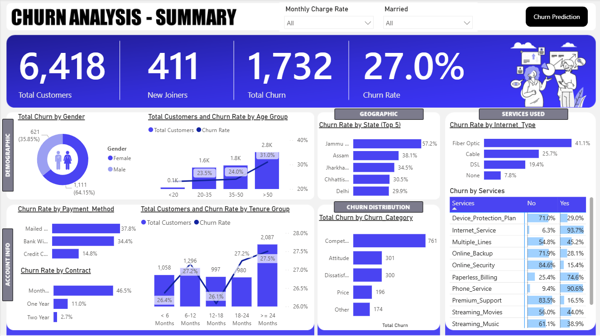
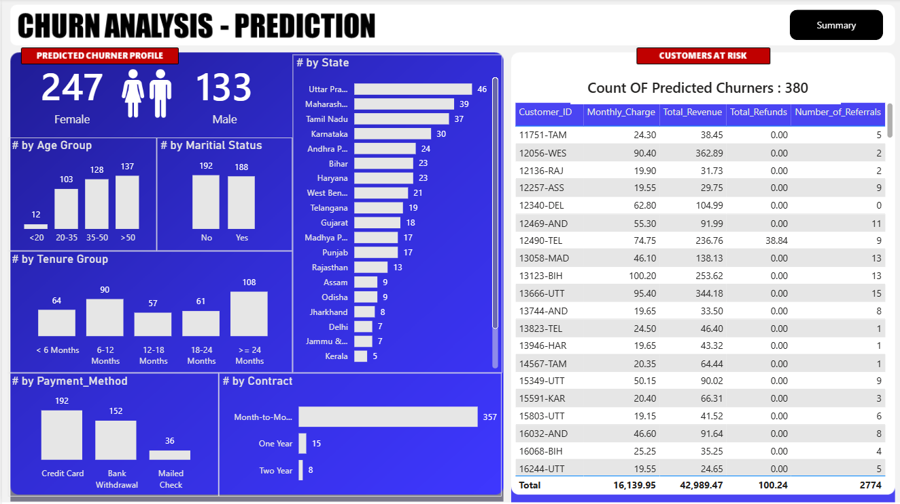
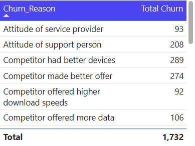

# 📊 Customer Churn Analysis & Prediction System

An end-to-end Data Analytics and Machine Learning project that analyzes customer churn behavior, identifies key churn drivers, and predicts customers at risk of leaving. The project combines SQL, Python, Machine Learning, and Power BI to provide actionable business insights and support customer retention strategies.

---

## 🚀 Project Overview

Customer churn is a critical challenge for subscription-based businesses. Retaining existing customers is often more cost-effective than acquiring new ones. This project focuses on understanding churn patterns, identifying at-risk customers, and helping businesses take proactive retention measures.

### Objectives

* Analyze customer demographics and behavior
* Identify factors contributing to customer churn
* Predict customers likely to churn using Machine Learning
* Build interactive dashboards for business stakeholders
* Generate actionable retention insights

---

## 📌 Features

* End-to-End Data Analytics Project
* SQL-Based Data Exploration & Analysis
* Customer Churn Prediction using Machine Learning
* Interactive Power BI Dashboards
* Customer Risk Identification
* Churn Driver Analysis
* Business Insight Generation
* Automated Prediction Workflow

---

## 🛠️ Tech Stack

### Data Analysis

* SQL Server
* Python
* Pandas
* NumPy

### Machine Learning

* Scikit-Learn
* XGBoost
* Joblib

### Data Visualization

* Power BI

### Data Source

* Customer Churn Dataset

---

## 📂 Project Structure

```text
customer-churn-analysis-prediction/
│
├── Data/
│   ├── Customer_Data.csv
│   ├── Prediction_Data.xlsx
│   └── Predictions.csv
│
├── SQL/
│   └── SQLQuery.sql
│
├── ML_Model/
│   └── Churn_Prediction.ipynb
│
├── PowerBI/
│   └── Churn_Analysis.pbix
│
├── Screenshots/
│   ├── Summary.png
│   ├── Prediction.png
│   └── Churn_Reason.png
│
├── README.md
└── requirements.txt
```

---

## ⚙️ How to Use This Project

### 1. Clone the Repository

```bash
git clone https://github.com/Mehtab161/customer-churn-analysis-prediction.git

cd customer-churn-analysis-prediction
```

### 2. Install Required Libraries

```bash
pip install -r requirements.txt
```

### 3. Open the Machine Learning Notebook

Launch Jupyter Notebook:

```bash
jupyter notebook
```

Open:

```text
ML_Model/Churn_Prediction.ipynb
```

### 4. Train the Model

Run all notebook cells to:

* Load customer data
* Perform data preprocessing
* Encode categorical features
* Train the churn prediction model
* Evaluate model performance
* Generate predictions

### 5. Predict Churn for New Customers

Place new customer records inside:

```text
Data/Prediction_Data.xlsx
```

Run the prediction section of the notebook.

Prediction results will be generated in:

```text
Data/Predictions.csv
```

### 6. Open the Power BI Dashboard

Open:

```text
PowerBI/Churn_Analysis.pbix
```

using Microsoft Power BI Desktop.

### 7. Refresh Dashboard Data

After generating new predictions:

1. Open Power BI.
2. Click **Home → Refresh**.
3. Dashboard visuals will update automatically.

---

## 🔄 Project Workflow

```text
Customer Data
      │
      ▼
SQL Data Analysis
      │
      ▼
Data Cleaning & Preprocessing
      │
      ▼
Machine Learning Model
      │
      ▼
Churn Predictions
      │
      ▼
Power BI Dashboard
      │
      ▼
Business Insights
```

---

## 📈 Dashboard Overview

### Summary Dashboard

The Summary Dashboard provides a high-level overview of customer churn trends and business performance.

#### Key Metrics

* Total Customers: 6,418
* New Joiners: 411
* Total Churned Customers: 1,732
* Churn Rate: 27.0%

#### Insights Covered

* Churn by Gender
* Churn by Age Group
* Churn by State
* Churn by Contract Type
* Churn by Payment Method
* Churn by Internet Service
* Churn by Tenure Group
* Churn Category Distribution

---

### Prediction Dashboard

The Prediction Dashboard highlights customers predicted to churn.

#### Key Features

* Predicted Churners Count
* Risk-Based Customer Segmentation
* Gender Distribution
* State-Wise Churn Risk Analysis
* Contract Analysis
* Payment Method Analysis
* Customer-Level Prediction Table

---

## 🤖 Machine Learning Pipeline

### Data Preprocessing

* Missing Value Handling
* Feature Encoding
* Feature Selection
* Data Transformation

### Model Development

1. Data Cleaning
2. Exploratory Data Analysis
3. Feature Engineering
4. Train-Test Split
5. Model Training
6. Model Evaluation
7. Prediction Generation

### Output

The model predicts:

* Churn Status
* Churn Probability
* High-Risk Customers
* Customer Retention Targets

---

## 📊 Key Business Insights

### Customer Behavior

* Month-to-Month customers exhibit the highest churn rates.
* Customers with shorter tenure are more likely to leave.
* Fiber Optic users show higher churn compared to other internet service users.
* Electronic payment methods are associated with increased churn.

### Churn Drivers

Major reasons behind customer churn include:

* Competitor offered better devices
* Competitor provided better offers
* Pricing concerns
* Poor support experience
* Service dissatisfaction

---

## 📸 Dashboard Screenshots

### Churn Summary Dashboard



---

### Churn Prediction Dashboard



---

### Churn Reasons Analysis



---

## 🎯 Business Impact

This solution helps organizations:

* Identify customers likely to churn
* Improve customer retention strategies
* Reduce revenue loss
* Understand churn patterns
* Prioritize high-risk customers
* Make data-driven decisions

---

## 🔮 Future Enhancements

* Streamlit Web Application Deployment
* Real-Time Churn Prediction
* Automated Power BI Refresh
* Customer Retention Recommendation Engine
* Model Monitoring Dashboard
* Cloud Deployment (Azure/AWS)

---

## 📋 Requirements

```text
pandas
numpy
scikit-learn
xgboost
matplotlib
seaborn
openpyxl
joblib
```

---

## 👨‍💻 Author

### Mehtab Khan

Computer Science Engineering (AI & ML)

**Skills:**

* SQL
* Python
* Machine Learning
* Power BI
* Data Analysis
* Data Visualization

---

## ⭐ Support

If you found this project useful, consider giving it a ⭐ on GitHub.

It helps others discover the project and motivates further improvements.
